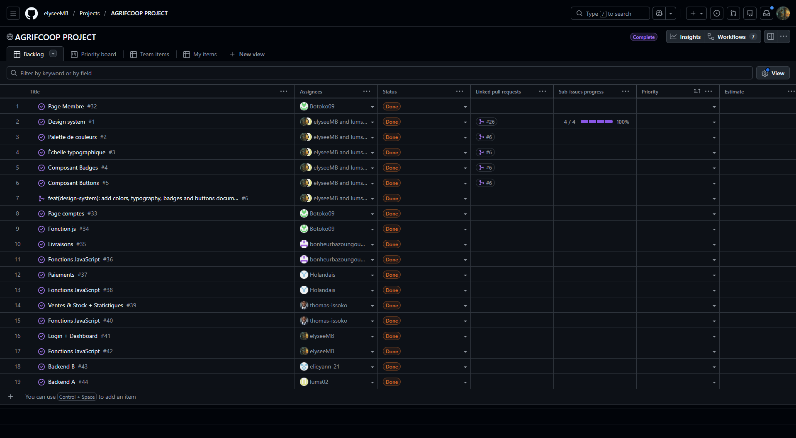

# AgriCoop Connect — Coopérative COMAKI, Kintélé

Application web de gestion pour la coopérative agricole COMAKI, basée à Kintélé. Elle digitalise l'ensemble des opérations de la coopérative : authentification des utilisateurs, gestion des membres, suivi des livraisons, paiements, ventes, stock et statistiques.

L'application s'appuie sur une analyse du cahier des charges COMAKI, incluant un module d'authentification (la Secrétaire assure le rôle d'administratrice) et la gestion des nouveaux membres directement depuis l'interface.

## Fonctionnalités

- **Authentification** — gestion des rôles (Secrétaire/Admin, Président, Trésorière, Responsable dépôt, Membre)
- **Membres** — création, recherche et filtrage des membres de la coopérative
- **Livraisons** — enregistrement et tri des livraisons par date
- **Paiements** — enregistrement des paiements et calcul des totaux
- **Ventes & Stock** — suivi des ventes et du stock disponible
- **Statistiques** — classement et reporting sur les volumes
- **Dashboard** — vue d'ensemble de l'activité

## Installation et lancement

**1. Démarrer l'API**

```bash
cd backend
pip install -r requirements.txt
python app.py
```

L'API tourne sur `http://localhost:5000`.

**2. Lancer le site**

Ouvrir `frontend/login/login.html` dans un navigateur (ou via l'extension Live Server de VS Code).

### Comptes de test

| Rôle               | Nom d'utilisateur | Mot de passe     |
| ------------------ | ----------------- | ---------------- |
| Secrétaire (Admin) | `smalonga`        | `Secretaire2026` |
| Président          | `floubota`        | `President2026`  |
| Trésorière         | `abikindou`       | `Tresoriere2026` |
| Responsable dépôt  | `jmabiala`        | `Depot2026`      |
| Membre             | `ankounkou`       | `Membre2026`     |

## Équipe

| Qui                                                    | Rôle                                                     |
| ------------------------------------------------------ | -------------------------------------------------------- |
| Mboussa Emmanuelito (elyseeMB)                         | Développeur Fullstack — Repo Admin                       |
| Botoko Steven (Botoko09)                               | Développeur Fullstack — Lead Fullstack                   |
| Bazoungoula Bonheur Amour Parfait (bonheurbazoungoula) | Développeur Fullstack                                    |
| Holandais Mbemba Scintillé Grâciel (Holandais)         | Développeur Fullstack                                    |
| Issoko Ulrich (thomas-issoko)                          | Développeur Fullstack                                    |
| Lumeya Kwivangana Exaucée (lums02)                     | Data Scientist — Lead Data                               |
| Ongouya Elie Yann (elieyann-21)                        | Data Scientist — Lead du groupe                          |
| Dieuveil Jaurès (VOUETA)                               | Marketing Digital — Lead Marketing & communication       |
| Junior Rex (OMBOULA KANGA)                             | Business Analyst — Lead Business Analyst & Product Owner |

## Répartition des tâches

| Qui                                                    | Dossier & pages                                                                        | Fonctions JS                                                                          |
| ------------------------------------------------------ | -------------------------------------------------------------------------------------- | ------------------------------------------------------------------------------------- |
| Mboussa Emmanuelito (elyseeMB)                         | `frontend/login/login.html` **+** `frontend/dashboard/dashboard.html` + Design system  | `validerFormulaireLogin`, `compterJoursActifs`                                        |
| Botoko Steven (Botoko09)                               | `frontend/membres/membres.html` **+** `frontend/comptes/comptes.html`                  | `filtrerMembresParStatut`, `rechercherMembreParNom`, `validerFormulaireNouveauMembre` |
| Bazoungoula Bonheur Amour Parfait (bonheurbazoungoula) | `frontend/livraisons/livraisons.html`                                                  | `validerFormulaireLivraison`, `trierLivraisonsParDate`                                |
| Holandais Mbemba Scintillé Grâciel (Holandais)         | `frontend/paiements/paiements.html`                                                    | `validerFormulairePaiement`, `calculerTotalPaiements`                                 |
| Issoko Ulrich (thomas-issoko)                          | `frontend/ventes/ventes.html` **+** `frontend/statistiques/statistiques.html`          | `getBadgeStock`, `formaterMontant`, `trierClassementParVolume`, `formaterDate`        |
| Lumeya Kwivangana Exaucée (lums02)                     | Design system + Backend A                                                              | —                                                                                     |
| Ongouya Elie Yann (elieyann-21)                        | Backend B                                                                              | —                                                                                     |
| Dieuveil Jaurès (VOUETA)                               | Proposition de valeur, rapport bailleur, AgriCoop_Connect_Presentation_5slides-2       | —                                                                                     |
| Junior Rex (OMBOULA KANGA)                             | User Stories & Backlog (3 jours), FRD — Fonctionnalités, BPMN, Catalogue des exigences | —                                                                                     |



## API — endpoints disponibles

Chaque page est dans son propre sous-dossier avec son fichier CSS dédié. L'essentiel de votre note porte sur vos **pages HTML/CSS** (structure sémantique, box model, Flexbox/Grid, responsive mobile/tablette/desktop). Chacun complète aussi 2 à 3 fonctions JS dans `frontend/functions.js`.

| Qui     | Dossier & pages                                                       | Fonctions JS                                                                          |
| ------- | --------------------------------------------------------------------- | ------------------------------------------------------------------------------------- |
| Dev FS1 | `frontend/login/login.html` **+** `frontend/dashboard/dashboard.html` | `validerFormulaireLogin`, `compterJoursActifs`                                        |
| Dev FS2 | `frontend/membres/membres.html` **+** `frontend/comptes/comptes.html` | `filtrerMembresParStatut`, `rechercherMembreParNom`, `validerFormulaireNouveauMembre` |
| Dev FS3 | `frontend/livraisons/livraisons.html`                                 | `validerFormulaireLivraison`, `trierLivraisonsParDate`                                |
| Dev FS4 | `frontend/paiements/paiements.html`                                   | `validerFormulairePaiement`, `calculerTotalPaiements`                                 |
| Dev FS5 | `frontend/ventes/ventes.html`                                         | `getBadgeStock`, `formaterMontant`                                                    |
| Dev FS6 | `frontend/statistiques/statistiques.html`                             | `trierClassementParVolume`, `formaterDate`                                            |

Chaque page contient des commentaires `<!-- TODO -->` indiquant le travail attendu, avec le layout, les éléments à construire et les classes déjà utilisées par `main.js` pour injecter le contenu dynamique. **Les éléments marqués "NE PAS MODIFIER" (IDs, scripts, formulaires) sont le câblage vers le backend — ne les changez pas, sinon les données ne s'afficheront plus.**

**Nouveauté — page Login (Dev FS1) :** c'est la première page que tout le monde voit. Gardez-la volontairement simple : un formulaire centré, pas de navigation complexe .

**Nouveauté — page Comptes (Dev FS2) :** réservée à la Secrétaire. `main.js` vérifie automatiquement le rôle de la personne connectée (via `/api/verifier-acces`) et affiche un message de refus si ce n'est pas elle — vous n'avez rien à coder pour cette vérification, seulement à styliser les deux états (formulaire visible / message de refus).

**Nouveauté — formulaire Nouveau membre (Dev FS2, sur la page Membres) :** un formulaire à 4 champs (prénom, nom, village, contact) en bas de la page Membres existante.

## Équipe Data Science — workflow

```bash
cd backend
pip install -r requirements.txt
python -m pytest -v        # ROUGE au départ (39 tests)
```
GET  /api/dashboard
GET  /api/membres
GET  /api/livraisons
GET  /api/paiements
GET  /api/ventes-stock
GET  /api/statistiques
GET  /api/rapport-bailleur
GET  /api/utilisateurs
GET  /api/villages
POST /api/login
```

## Données

`backend/data/comaki.json` constitue la source unique de vérité :

- 8 membres (nom, village, contact)
- 25 livraisons (avril–juillet 2026)
- 8 paiements (avec mode de paiement)
- 3 acheteurs, 9 ventes
- 5 comptes utilisateurs
- 6 villages de référence

## Règles métier

| Règle | Description                                                                                       |
| ----- | ------------------------------------------------------------------------------------------------- |
| RM-1  | Une livraison à quantité ≤ 0 est refusée.                                                         |
| RM-2  | Seuls Manioc, Maïs et Arachide sont acceptés comme cultures.                                      |
| RM-3  | Un paiement ne peut jamais dépasser le solde restant dû à un membre.                              |
| RM-4  | Une vente ne peut jamais dépasser le stock disponible.                                            |
| RM-5  | Le rapport partenaire ne contient jamais de donnée nominative (aucun nom de membre).              |
| RM-6  | Un utilisateur ne peut accéder qu'aux actions autorisées pour son rôle.                           |
| RM-7  | Un doublon quasi certain de membre propose la fiche existante plutôt que d'en créer une nouvelle. |

## Architecture technique

Les fonctions logiques respectent le principe de fonction pure : des paramètres en entrée, une valeur en sortie, sans effet de bord (pas d'appel réseau ni de manipulation directe du DOM). Ce câblage est géré par `main.js` côté frontend et par `logic.py` côté backend.
